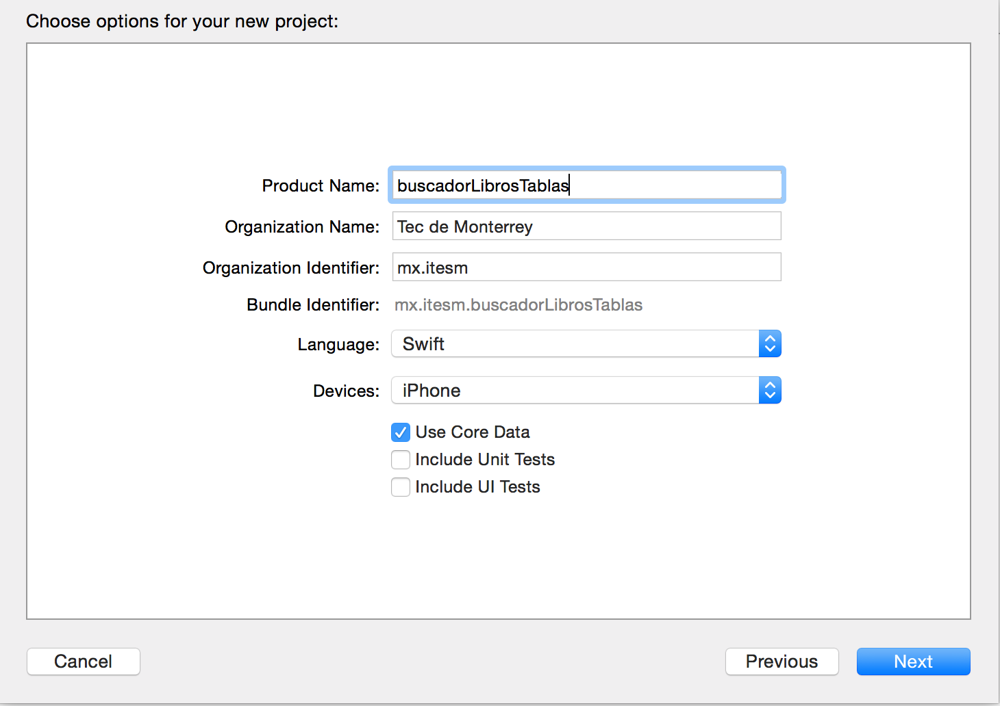
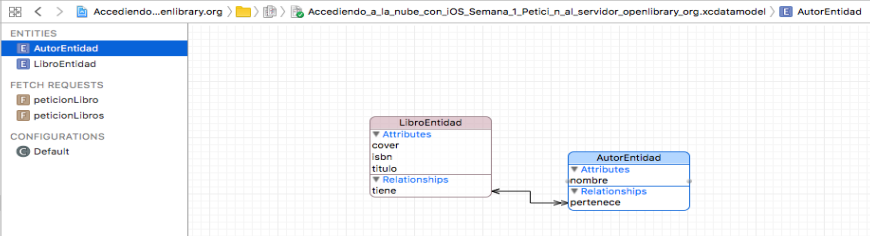
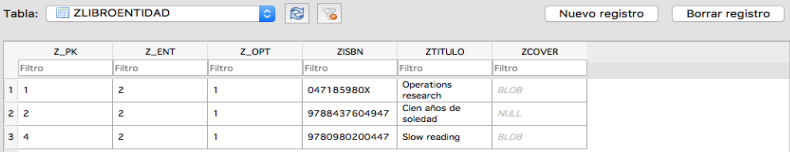
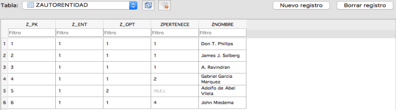

# Petición al servidor openlibrary.org
Tarea "Petición al servidor openlibrary.org" del curso "Accediendo a la nube con iOS" que se lleva en el portal Coursera.
## Instrucciones
En este entregable desarrollarás una aplicación usando Xcode que realice una petición a [Open Library](https://openlibrary.org/)

Para ello deberás crear una interfaz de usuario, usando la herramienta Storyboard que contenga:

1. Una caja de texto para capturar el ISBN del libro a buscar
2. EL botón de "enter" del teclado del dispositivo deberá ser del tipo de búsqueda ("Search")
3. El botón de limpiar ("clear") deberá estar siempre presente
4. Una vista texto (**Text View**) para mostrar el resultado de la petición

Un ejemplo de URL para acceder a un libro es:

[https://openlibrary.org/api/books?jscmd=data&format=json&bibkeys=ISBN:978-84-376-0494-7](https://openlibrary.org/api/books?jscmd=data&format=json&bibkeys=ISBN:978-84-376-0494-7)

Su programa deberá sustituir el último código de la URL anterior (en este caso 978-84-376-0494-7) por lo que se ponga en la caja de texto

Al momento de presionar buscar en el teclado, se deberá mostrar los datos crudos (sin procesar) producto de la consulta en la vista texto en concordancia con el ISBN que se ingreso en la caja de texto

En caso de error (problemas con Internet), se deberá mostrar una alerta indicando esta situación

Sube tu solución a GitHub e ingresa la URL en el campo correspondiente

## Criterios de revisión
1. ¿Existe una enlace a GitHub con el proyecto?
  - Si (1 punto)
  - No (0 puntos)
2. ¿El programa está hecho en Swift?
  - Si (1 punto)
  - No (0 puntos)
3. ¿Tiene un campo de texto que permite la captura del ISBN?
  - Si (1 punto)
  - No (0 puntos)
4. ¿Al hacer clic sobre el campo de texto, el teclado que emerge muestra la tecla de “Entrada” como “Búsqueda”?
  - Si (1 punto)
  - No (0 puntos)
5. La marca de "limpiar" en la caja de texto aparece todo el tiempo
  - Si (1 punto)
  - No (0 puntos)
6. En caso de falla en Internet, se muestra una alerta indicando ese problema
  - Si (1 punto)
  - No (0 puntos)
7. Se muestra el resultado en concordancia al ISBN ingresado
  - Si (5 puntos)
  - No (0 puntos)

## Resultado
Se muestra la pantalla del iPhone 7 al ejecutar el programa:
* Se muestran los datos crudos (sin procesar) producto de la consulta en la vista texto en concordancia con el ISBN que se ingreso en la caja de texto (hacer click en la imagen para ver la ejecución):

")

*  En caso de falla o de producirse algún error se muestra una alerta con el código y descripción del error (hacer click en la imagen para ver la ejecución):

")

***

# Procesando el resultado de la petición al servidor openlibrary.org
Tarea "Procesando el resultado de la petición al servidor openlibrary.org" del curso "Accediendo a la nube con iOS" que se lleva en el portal Coursera.
## Instrucciones
En este entregable desarrollarás una aplicación usando Xcode que después de haber realizado una petición a [Open Library](https://openlibrary.org/) (entregable anterior) analice os datos JSON obtenidos y los presente de manera adecuada

Para ello deberás crear una interfaz de usuario, usando la herramienta Storyboard que contenga:

1. Una caja de texto para capturar el ISBN del libro a buscar
2. EL botón de "enter" del teclado del dispositivo deberá ser del tipo de búsqueda ("Search")
3. El botón de limpiar ("clear") deberá estar siempre presente
4. En la vista deberás poner elementos para mostrar:
  - El título del libro
  - Los autores (recuerda que está en plural, pueden ser varios)
  - La portada del libro (en caso de que exista)

Un ejemplo de URL para acceder a un libro es:

[https://openlibrary.org/api/books?jscmd=data&format=json&bibkeys=ISBN:978-84-376-0494-7](https://openlibrary.org/api/books?jscmd=data&format=json&bibkeys=ISBN:978-84-376-0494-7)

Su programa deberá sustituir el último código de la URL anterior (en este caso 978-84-376-0494-7) por lo que se ponga en la caja de texto

Al momento de presionar buscar en el teclado, se deberá mostrar los datos crudos (sin procesar) producto de la consulta en la vista texto en concordancia con el ISBN que se ingreso en la caja de texto

En caso de error (problemas con Internet), se deberá mostrar una alerta indicando esta situación

Sube tu solución a GitHub e ingresa la URL en el campo correspondiente

## Criterios de revisión
La aplicación deberá tener la funcionalidad especificada y en la vista se deberán encontrar los siguientes elementos:

1. Una caja de texto para capturar el ISBN del libro a buscar
2. EL botón de "enter" del teclado del dispositivo deberá ser del tipo de búsqueda ("Search")
3. El botón de limpiar ("clear") deberá estar siempre presente
4. En la vista deberás poner elementos para mostrar:
  - El título del libro
  - Los autores (recuerda que está en plural, pueden ser varios)
  - La portada del libro (en caso de que exista)
5. En caso de error (problemas con Internet), se deberá mostrar una alerta indicando esta situación

## Resultado
Se muestra la pantalla del iPhone 7 al ejecutar el programa:
* A partir del ISBN tipeado se muestran los datos procesados que son la información del libro buscado. Estos son mostrados de manera adecuada y con atributos (hacer click en la imagen para ver la ejecución):

* En caso de falla o de producirse algún error se muestra una alerta con el código y descripción del error como se muestra en el resultado correspondiente a errores de [Petición al servidor openlibrary.org](#resultado_error).

***

# Uso de vistas jerárquicas para mostrar el resultado de peticiones al servidor openlibrary.org
Tarea "Uso de vistas jerárquicas para mostrar el resultado de peticiones al servidor openlibrary.org" del curso "Accediendo a la nube con iOS" que se lleva en el portal Coursera.
## Instrucciones
En este entregable desarrollarás una aplicación usando Xcode que realice una petición a [Open Library](https://openlibrary.org/) y que muestre el resultado en una tabla jerárquica a dos niveles. En el primer nivel se encontrará una vista tabla, mostrando los títulos de libros ya buscados. Al momento de seleccionar uno de los renglones de la tabla, el detalle del libro deberá ser mostrado.

La idea es que los libros que se vayan buscando se vayan integrando la estructura que representará la fuente de datos de la vista tabla.

Puedes seleccionar, al momento de crear tu proyecto la plantilla Maestro-Detalle. De esta manera se facilita la codificación de tu aplicación

**IMPORTANTE**. Al momento de crear tu proyecto, no olvides seleccionar el uso de Core Data ya que se usará en ese módulo y así se facilitan las cosas

## Criterios de revisión
1. Al iniciar la aplicación, una vista tabla deberá ser mostrada
2. Deberá contener un **UIBarButtonItem**, en específico el Add (signo +) en la barra de navegación que permita hacer una búsqueda y añadir el libro a la tabla
3. Al presionar el botón de añadir (punto anterior), se deberá mostrar una vista que permita ingresar el ISBN de un libro y mostrar, en caso de éxito de la búsqueda:
  - El título del libro
  - Los autores del libro
  - La portada (en caso de que se encuentre)
4. Al regresar a la vista tabla, el título del libro buscado deberá aparecer en la tabla
5. Si seleccionamos un renglón de la tabla que contenga un título de libro, deberá mostrar sus detalles

## Resultado
Se muestra la pantalla del iPad Air al ejecutar el programa (hacer click en la imagen para ver la ejecución):

")

Se muestra la pantalla del iPhone 7 al ejecutar el programa (hacer click en la imagen para ver la ejecución):

")

***

# Añadiendo persistencia a la búsqueda de libros
Tarea "Añadiendo persistencia a la búsqueda de libros" del curso "Accediendo a la nube con iOS" que se lleva en el portal Coursera.
## Instrucciones
Además de lo establecido en el entregable anterior, deberá incluir persistencia de datos, es decir (se repite la descripción del entregable anterior por conveniencia).

En este entregable desarrollarás una aplicación usando Xcode que realice una petición a [Open Library](https://openlibrary.org/) y que muestre el resultado en una tabla jerárquica a dos niveles. En el primer nivel se encontrará una vista tabla, mostrando los títulos de libros ya buscados. Al momento de seleccionar uno de los renglones de la tabla, el detalle del libro deberá ser mostrado.

La idea es que los libros que se vayan buscando se vayan integrando la estructura que representará la fuente de datos de la vista tabla.

Puedes seleccionar, al momento de crear tu proyecto la plantilla Maestro-Detalle. De esta manera se facilita la codificación de tu aplicación

**IMPORTANTE**. Al momento de crear tu proyecto, no olvides seleccionar el uso de Core Data ya que se usará en ese módulo y así se facilitan las cosas

**ADICIONALMENTE**, utilizarás los conceptos de Core Data para hacer persistir los datos de la búsqueda de libros

## Criterios de revisión
1. Al iniciar la aplicación, una vista tabla deberá ser mostrada
2. Deberá contener un **UIBarButtonItem**, en específico el Add (signo +) en la barra de navegación que permita hacer una búsqueda y añadir el libro a la tabla
3. Al presionar el botón de añadir (punto anterior), se deberá mostrar una vista que permita ingresar el ISBN de un libro y mostrar, en caso de éxito de la búsqueda:
  - El título del libro
  - Los autores del libro
  - La portada (en caso de que se encuentre)
4. Al regresar a la vista tabla, el título del libro buscado deberá aparecer en la tabla
5. Si seleccionamos un renglón de la tabla que contenga un título de libro, deberá mostrar sus detalles
6. Deberá haber un esquema de datos que muestre las entidades y sus relaciones que serán necesarias para almacenar los datos resultado de una búsqueda de un libro por su ISBN
7. Al relanzar la aplicación la vista tabla deberá mostrar los títulos de los libros que fueron el resultado de búsquedas anteriores

## Resultado
Se realiza el esquema de la base de datos con estas entidades y relaciones:

Se muestra la pantalla del iPad Air al ejecutar el programa (hacer click en la imagen para ver la ejecución):

")

Se muestra la pantalla del iPhone 6 al ejecutar el programa (hacer click en la imagen para ver la ejecución):

")

Luego de la ejecución del programa la entidad **LibroEntidad** queda así:

Y la entidad **AutorEntidad** queda así:

***
Juan Carlos Carbajal Ipenza
